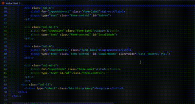

# *Cadastro de Endereço* ⭐

Este projeto consiste em um formulário de cadastro de endereço que utiliza a API ViaCEP para buscar informações de endereço a partir do CEP informado pelo usuário. O formulário é responsivo e estilizado com Bootstrap.

# Tecnologias Utilizadas 🖥️
- **HTML**: Estrutura básica do formulário.
- **CSS**: Estilo do formulário (Bootstrap).
- **JavaScript**: Lógica para a consulta da API e manipulação do DOM.
- **API ViaCEP**: Serviço para consultar dados de endereço a partir do CEP.

# Funcionalidades 🔦
- Limpeza dos campos do formulário ao iniciar uma nova pesquisa.
- Validação do CEP informado (deve conter 8 dígitos numéricos).
- Preenchimento automático dos campos de endereço ao obter dados válidos da API.
- Exibição de alertas para casos de erro (CEP inválido ou não encontrado).

# Estrutura do Projeto ✅
- `index.html`: Arquivo HTML que contém o formulário.
- `main.css`: Arquivo CSS para estilização (se necessário).
- `main.js`: Arquivo JavaScript que contém a lógica para a consulta da API e manipulação do formulário.

# Instruções para Uso ❓❓
1. Clone o repositório em sua máquina local.
2. Abra o arquivo `index.html` em um navegador.
3. Insira um CEP válido e clique fora do campo para acionar a pesquisa.
4. Os campos do endereço serão preenchidos automaticamente, se o CEP for encontrado.

# Como Acessar o Projeto 🔅
Você pode acessar o projeto através do GitHub Pages [aqui](https://queijitos.github.io/Form-CadEndere-o/index.html).

# Aprendizados 💡

## `A palavra-chave async`
 é utilizada para declarar uma função assíncrona. Funções assíncronas permitem o uso do await, que faz com que o código espere até que uma Promessa seja resolvida ou rejeitada, facilitando o trabalho com operações assíncronas, como chamadas de API.

## `A propriedade value`
 é usada para acessar ou definir o valor de um campo de formulário, como um campo de texto ou input. No contexto deste projeto, o value é utilizado para obter o valor do campo onde o usuário insere o CEP, por exemplo: document.getElementById('cep').value.

## `O método fetch()`
 é utilizado para fazer solicitações HTTP. Ele retorna uma Promessa que resolve em uma resposta (quando a requisição é bem-sucedida) ou rejeita com um erro. No projeto, o fetch é utilizado para fazer uma requisição à API ViaCEP e obter os dados de endereço a partir do CEP informado.

## `A palavra-chave await`
 só pode ser usada dentro de uma função assíncrona (declarada com async). Ela faz com que o código espere a resolução de uma Promessa antes de continuar. No projeto, o await é usado para esperar pela resposta da API antes de prosseguir com o preenchimento do formulário.

## `O método json()`
 é usado para converter a resposta de uma solicitação fetch() em um objeto JavaScript. Isso é necessário quando a resposta da API está no formato JSON (JavaScript Object Notation), que é o caso da resposta da API ViaCEP. Após chamar fetch(), o json() é usado para interpretar o corpo da resposta.

## `O método hasOwnProperty()`
 verifica se um objeto possui uma propriedade específica. No projeto, ele pode ser utilizado para verificar se os dados retornados da API incluem as propriedades desejadas, como logradouro ou bairro, antes de tentar acessar esses valores.

## `O método addEventListener()`
 é usado para configurar uma função que será executada quando um determinado evento ocorrer em um elemento. No formulário de cadastro de endereço, ele pode ser usado para detectar quando o usuário sai do campo de CEP (evento focusout) e, assim, disparar a busca dos dados de endereço automaticamente.

## `O evento focusout`
 é disparado quando um elemento (como um campo de texto) perde o foco, ou seja, quando o usuário clica fora do campo ou o deixa usando a tecla Tab. No projeto, esse evento pode ser usado para iniciar a busca pelo CEP quando o usuário termina de preenchê-lo.

# Referências 🎓
- [Documentação da API ViaCEP](https://viacep.com.br/)
- [Bootstrap](https://getbootstrap.com/)
- [MDN Web Docs - JavaScript](https://developer.mozilla.org/pt-BR/docs/Web/JavaScript)

# Colaboradores 👥
- José Walter De Oliveira Junior
- Leonardo Rocha 

# Imagens e GIFs 🖼️

#

# Conclusão 🏁
Este projeto foi uma excelente oportunidade de aprender sobre manipulação de DOM, consumo de APIs e uso de tecnologias web modernas.

